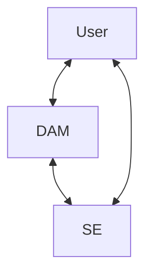

# Policy Derived Data Access Management Platform for Heterogenous Storage Endpoints

## Overview

This system is a prototype for a Data Access Management (DAM) serice/application to manage access to data assets on various storage enpoints (SE) via a centralized service. The primary goal is to create a one to one relation between a legal agreement defining the terms of use for a restricted data asset and the underlying technical implementation of that access with signed users of that policy. The implementation should be

1.  Agnostic about the nature of SEs
2.  Allow direct connection to SE for data transfer (as opposed to a connection via the DAM service host) where such connection is limited only to those assets granted by the signed policy
3.  Provide an easy to use and intuitive web based GUI for data asset administrators

This is a "glue code" application; the goal is not to develop a new standard or system, rather a generic tool and framework for connecting and managing policy restricted data assets. To this end three basic technical interfaces need to be defined

1.  Users - Data Access Manager
2.  Data Access Manager - Storage Enpoints
3.  Users - Storage Endpoints

These in effect form a trangular interaction whose connections are granted, but not conducted through, the DAM service.

Here the User - SE connection is token based where the token fully determines the parameters of the interaction (i.e. time expiry and scope). Tokens are granted via the User - DAM interface, derived from secrets shared between the DAM and SEs.

## User - Data Access Manager Interface

## Data Access Manager - Storage Enpoint Interface

## User - Storage Endpoint Interface

Users interact with the DAM via a web based API. Ultimately all access requests are requested and granted through the DAM, with the DAM returning the mechanism of access (e.g. the relevant implementation of the User - SE interface). 

## Admin File Management Application

## Overview

The Admin File Management Application is designed to allow administrators to manage user access to files and folders within a specified system. It provides functionalities to view, create, and update user policies, including the ability to create new users and assign specific read/write permissions to them. The application uses FastAPI as the backend framework and Jinja2 for templating, with the file trees displayed using the `jstree` JavaScript plugin. The UI is rudimentary and are meant solely for the purpose of exposing endpoints and conecptualizing the fundamental workflows for the administrator.

## Endpoints

### Admin Endpoints (`admin.py`)

The admin endpoints provide functionality for managing users and their access policies. These endpoints are protected and only accessible by users with administrative privileges.

- **User Management**
  - **Get User Information**: Retrieve information about a specific user or list all users.
  - **Add User**: Create a new user with a specified role and return the user's secret key.
  - **Remove User**: Delete an existing user from the system.

- **Policy Management**
  - **Get Policies**: Retrieve access policies for a specific user and resource.
  - **Add Policy**: Create a new policy granting a user access to a specified resource.
  - **Remove Policy**: Delete an existing policy for a user.

- **Asset Management**
  - **Get All Assets**: Retrieve and display all assets for a specific access point.
  - **File Management GUI**: Display an interface for managing files and folders, allowing administrators to assign user permissions.

### Asset Endpoints (`assets.py`)

The asset endpoints provide functionality for users to interact with their files and folders. These endpoints require user authentication and are designed to facilitate file uploads, downloads, and listing of user assets.

- **General and User Endpoints**
  - **List Assets**: Retrieve a list of all assets available to the authenticated user.
  - **Retrieve Asset**: Generate presigned URLs for accessing specific assets and serve an HTML template with these URLs.

- **Forms and User Interaction**
  - **Upload Form**: Render a form for uploading files, allowing users to select and upload files to the system.
  - **Download Form**: Render a form for downloading files, displaying available files and generating download links.

- **Presigned URL Endpoints**
  - **Generate Upload URL**: Create a presigned URL for uploading a file to the system.
  - **Generate Download URL**: Create presigned URLs for downloading assets, providing secure access to user files.

## Authentication and Authorization

- **Admin Access Control**: Admin endpoints use a decorator to ensure only users with administrative privileges can access them. The `is_admin` function validates the user's credentials and role.
- **User Validation**: The `validate_credentials` function checks user credentials for endpoints requiring user authentication, ensuring secure access to user-specific data.

## Utilities and Helper Functions

- **File Tree Conversion**: The `convert_file_tree_to_dict` function converts a file tree into a dictionary format suitable for rendering with the `jstree` plugin, facilitating the display of hierarchical file structures in the user interface.

## Templates

- **Jinja2 Templates**: The application uses Jinja2 templates to render HTML pages for various forms and interfaces, including user management, file upload, and download forms. These templates are dynamically populated with data from the backend to provide a seamless user experience.

## Summary

This application provides a robust system for managing user access to files and folders, with a strong focus on security and ease of use. Administrators can efficiently manage users and their permissions, while users can easily upload and download their files through an intuitive web interface.
