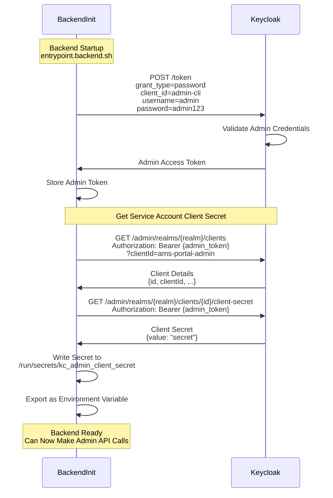
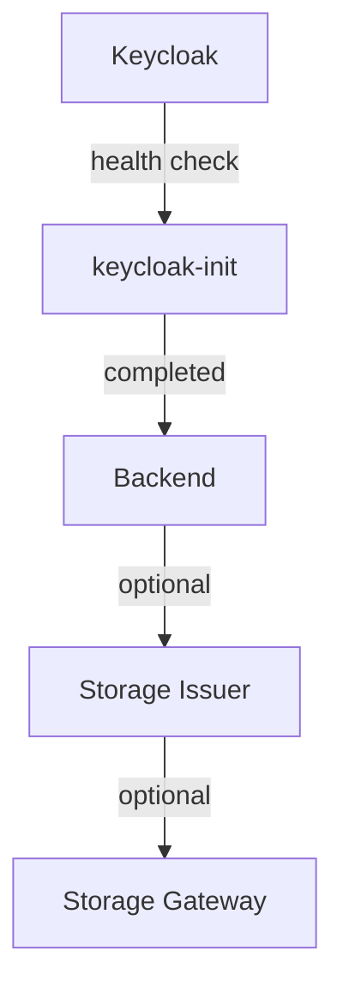

# Backend Initialization

This document describes the backend initialization process, including Keycloak configuration, secret management, and service account setup.

## Overview

The backend initialization happens during container startup via `entrypoint.backend.sh`. This process configures the backend to communicate with Keycloak as an admin client.

## Initialization Sequence

### 1. Service Account Flow

How the backend obtains its service account credentials from Keycloak:



## Initialization Steps

### Step 1: Admin Token Acquisition

The backend uses the **Resource Owner Password Credentials** flow to obtain an admin token:

```bash
# Request admin token using Keycloak admin credentials
curl -X POST "${KEYCLOAK_DOMAIN}/realms/master/protocol/openid-connect/token" \
  -d "grant_type=password" \
  -d "client_id=admin-cli" \
  -d "username=${KEYCLOAK_ADMIN}" \
  -d "password=${KEYCLOAK_ADMIN_PASSWORD}"
```

**Response:**
```json
{
  "access_token": "eyJhbGc...",
  "token_type": "Bearer",
  "expires_in": 60
}
```

### Step 2: Retrieve Service Account Client ID

Query Keycloak to find the internal UUID for the admin client:

```bash
# Get client details by clientId
curl "${KEYCLOAK_DOMAIN}/admin/realms/${KEYCLOAK_REALM}/clients?clientId=${KEYCLOAK_ADMIN_CLIENT_ID}" \
  -H "Authorization: Bearer ${ADMIN_TOKEN}"
```

**Response:**
```json
[
  {
    "id": "550e8400-e29b-41d4-a716-446655440000",
    "clientId": "ams-portal-admin",
    "enabled": true,
    ...
  }
]
```

### Step 3: Retrieve Client Secret

Fetch the client secret using the internal client UUID:

```bash
# Get client secret
curl "${KEYCLOAK_DOMAIN}/admin/realms/${KEYCLOAK_REALM}/clients/${CLIENT_UUID}/client-secret" \
  -H "Authorization: Bearer ${ADMIN_TOKEN}"
```

**Response:**
```json
{
  "type": "secret",
  "value": "FIJodPY8lmXhUT..."
}
```

### Step 4: Store Secret Securely

The secret is stored in a tmpfs mount (RAM-only filesystem):

```bash
# Write to tmpfs (not persisted to disk)
echo -n "${CLIENT_SECRET}" > /run/secrets/kc_admin_client_secret

# Set restrictive permissions
chmod 400 /run/secrets/kc_admin_client_secret
```

### Step 5: Configure Environment

Export the secret path for the application:

```bash
export KEYCLOAK_ADMIN_CLIENT_SECRET_FILE="/run/secrets/kc_admin_client_secret"
```

## Configuration Files

### entrypoint.backend.sh

Location: `backend/entrypoint.backend.sh`

The main initialization script that:
1. Waits for Keycloak to be ready
2. Retrieves admin token
3. Fetches client secret
4. Configures environment
5. Starts the backend application

**Key sections:**
```bash
# Wait for Keycloak
wait_for_keycloak() {
  until curl -sf "${KEYCLOAK_DOMAIN}/health/ready" > /dev/null; do
    echo "Waiting for Keycloak..."
    sleep 2
  done
}

# Get admin token
get_admin_token() {
  curl -X POST "${KEYCLOAK_DOMAIN}/realms/master/protocol/openid-connect/token" \
    -d "grant_type=password" \
    -d "client_id=admin-cli" \
    -d "username=${KEYCLOAK_ADMIN}" \
    -d "password=${KEYCLOAK_ADMIN_PASSWORD}"
}
```

### init_keycloak.sh

Location: `backend/init_keycloak.sh`

One-time Keycloak configuration script that:
1. Ensures realm exists (imported from `keycloak-realm-export.json`)
2. Verifies service account client configuration
3. Validates service account roles

**This script runs once** via the `keycloak-init` service in Docker Compose.

## Secret Management

### tmpfs Mounts

Secrets are stored in memory-only filesystems (tmpfs) to prevent disk persistence:

```yaml
# docker-compose.backend.yml
services:
  backend:
    tmpfs:
      - /run/secrets:rw,noexec,nosuid,nodev
```

**Benefits:**
- ✅ Secrets never written to disk
- ✅ Automatically cleared on container restart
- ✅ No risk of secrets in container layers
- ✅ Complies with security best practices

### Secret File Paths

| Secret | File Path | Usage |
|--------|-----------|-------|
| Admin Client Secret | `/run/secrets/kc_admin_client_secret` | Backend admin operations |
| Storage Issuer API Key | `/run/secrets/storage_issuer_api_key` | POSIX storage token generation |
| JWT Private Key | `/run/secrets/jwt_private_key` | Storage Issuer token signing |

## Service Dependencies

The initialization process has strict dependency ordering:



**Docker Compose dependency configuration:**
```yaml
services:
  keycloak:
    healthcheck:
      test: ["CMD-SHELL", "curl -sf http://localhost:8080/health/ready"]

  keycloak-init:
    depends_on:
      keycloak:
        condition: service_healthy
    restart: "no"

  backend:
    depends_on:
      keycloak-init:
        condition: service_completed_successfully
```

## Troubleshooting

### Issue: "Failed to get admin token"

**Symptoms:**
```
Error: Failed to get admin token
Status: 401 Unauthorized
```

**Causes:**
- Keycloak not fully initialized
- Wrong admin credentials
- Keycloak not accessible at configured domain

**Solutions:**
```bash
# Check Keycloak health
curl http://keycloak.local:8080/health/ready

# Verify admin credentials
docker exec ams-keycloak cat /opt/keycloak/data/import/realm.json | grep admin

# Check network connectivity
docker exec ams-backend ping keycloak.local
```

### Issue: "Client not found"

**Symptoms:**
```
Error: Client 'ams-portal-admin' not found
```

**Causes:**
- Keycloak realm not imported
- `init_keycloak.sh` didn't run successfully

**Solutions:**
```bash
# Check if realm exists
curl http://keycloak.local:8080/admin/realms/ams-portal \
  -H "Authorization: Bearer ${ADMIN_TOKEN}"

# Re-run Keycloak initialization
docker restart ams-keycloak-init
docker logs ams-keycloak-init

# Force realm import
docker exec ams-keycloak \
  /opt/keycloak/bin/kc.sh import \
  --file /opt/keycloak/data/import/realm.json \
  --override true
```

### Issue: "Permission denied reading secret file"

**Symptoms:**
```
PermissionError: [Errno 13] Permission denied: '/run/secrets/kc_admin_client_secret'
```

**Causes:**
- Incorrect file permissions
- Secret file not created
- tmpfs mount failed

**Solutions:**
```bash
# Check tmpfs mount
docker exec ams-backend df -h | grep tmpfs

# Check secret file exists
docker exec ams-backend ls -la /run/secrets/

# Recreate secret with correct permissions
docker exec ams-backend sh -c "
  echo -n 'secret_value' > /run/secrets/kc_admin_client_secret
  chmod 400 /run/secrets/kc_admin_client_secret
"
```

### Issue: "Backend not starting after Keycloak init"

**Symptoms:**
- Backend container exits immediately
- No backend logs

**Solutions:**
```bash
# Check backend logs
docker logs ams-backend

# Verify all dependencies are ready
docker ps --filter "name=ams-"

# Check entrypoint script
docker exec ams-backend cat /app/entrypoint.backend.sh

# Manual backend start for debugging
docker exec -it ams-backend bash
python server.py
```

## Security Considerations

### Credential Rotation

**Admin credentials:**
- Change default `admin/admin123` in production
- Use strong passwords (16+ characters, mixed case, symbols)
- Consider using Keycloak federation with LDAP/AD

**Service account secrets:**
- Rotate client secrets periodically
- Use secret management tools (HashiCorp Vault, AWS Secrets Manager)
- Never commit secrets to version control

### Network Security

**Keycloak access:**
- Use HTTPS in production (`https://keycloak.example.com`)
- Configure proper DNS (not `keycloak.local`)
- Enable Keycloak's security features (rate limiting, brute force protection)

**Docker networking:**
- Backend should only expose port 8000
- Keycloak admin console should be restricted (firewall rules)
- Use Docker secrets in Swarm mode for production

### Token Security

**Admin tokens:**
- Short expiration (60 seconds default)
- Only used during initialization
- Not persisted after startup

**Client secrets:**
- Stored in tmpfs (memory-only)
- Restrictive file permissions (400)
- Regenerated on client reset

## Production Deployment

### Checklist

- [ ] Change default Keycloak admin password
- [ ] Use external PostgreSQL for Keycloak (not dev-file)
- [ ] Configure HTTPS/TLS for all services
- [ ] Enable Keycloak production mode
- [ ] Use Docker secrets (not environment variables)
- [ ] Implement secret rotation policy
- [ ] Configure proper DNS (not .local domains)
- [ ] Set up monitoring for initialization failures
- [ ] Enable audit logging
- [ ] Configure backup for Keycloak database

### Example Production Configuration

```yaml
# docker-compose.prod.yml
services:
  keycloak:
    environment:
      KC_DB: postgres
      KC_DB_URL: jdbc:postgresql://postgres:5432/keycloak
      KC_HOSTNAME: auth.example.com
      KC_HOSTNAME_STRICT: "true"
      KC_HTTPS_CERTIFICATE_FILE: /etc/certs/cert.pem
      KC_HTTPS_CERTIFICATE_KEY_FILE: /etc/certs/key.pem
    secrets:
      - keycloak_admin_password
      - postgres_password

  backend:
    secrets:
      - kc_admin_client_secret
      - storage_issuer_api_key
    environment:
      KEYCLOAK_DOMAIN: https://auth.example.com

secrets:
  keycloak_admin_password:
    external: true
  postgres_password:
    external: true
  kc_admin_client_secret:
    external: true
  storage_issuer_api_key:
    external: true
```

## Related Documentation

- [Authentication Sequences](../../docs/diagrams/sequence-authentication.md) - User authentication flows
- [Docker Setup Guide](../DOCKER_SETUP.md) - Complete deployment instructions
- [Backend README](../README.md) - Backend overview and development

---

**Last Updated:** 2025-10-29
