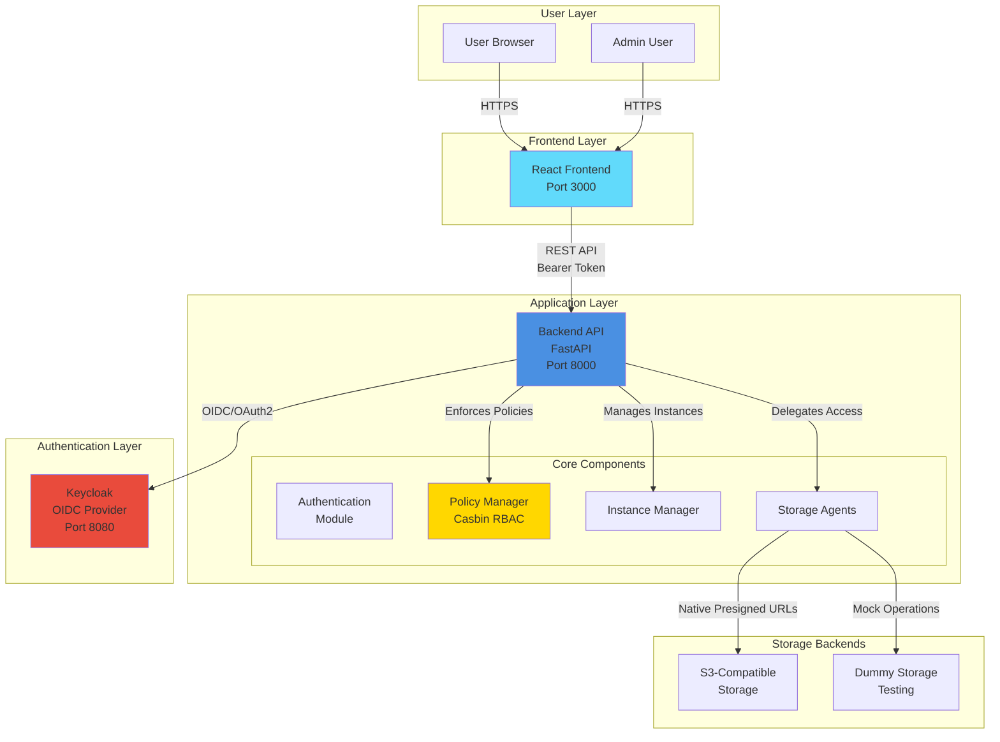
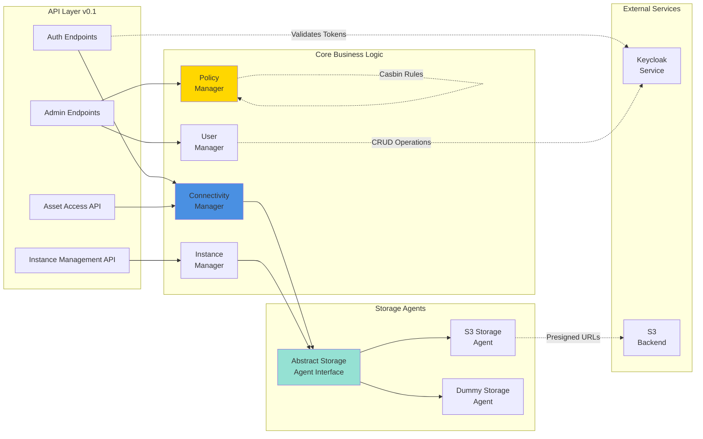
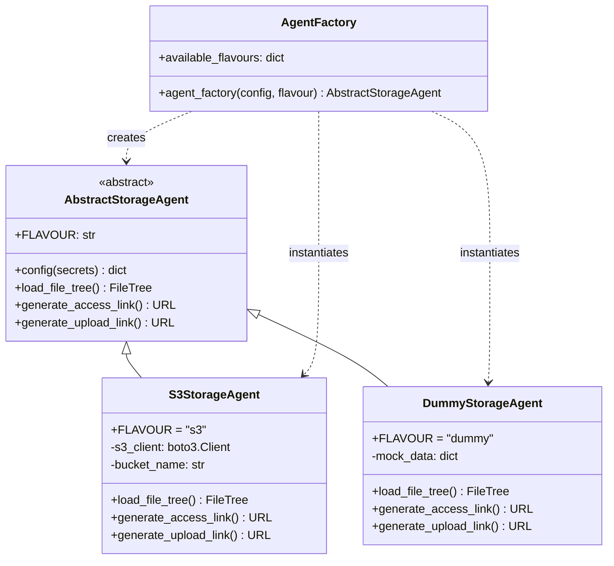
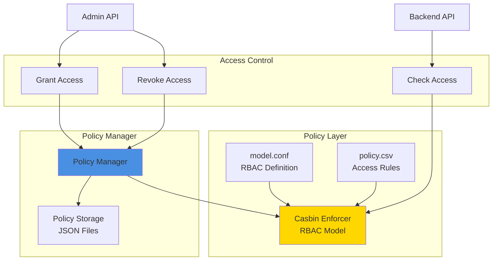
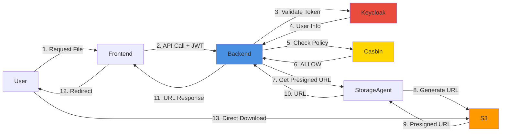

# Component Architecture

## System Overview

High-level view of the AMS Data Portal components and their relationships.

## Backend Core Components

Detailed view of the backend application structure.

## Storage Agent Architecture

Pluggable storage backend system using the Abstract Factory pattern.

## Policy Management Architecture

Casbin-based RBAC system with flexible policy enforcement.

## Data Flow

How data moves through the system for a typical file download request.

---

## Component Responsibilities

### Frontend (React)
- User interface and interaction
- Authentication flow (OAuth2/OIDC)
- API communication with Bearer tokens
- File upload/download UI
- Admin dashboard

### Backend (FastAPI)
- REST API endpoints
- JWT token validation
- Policy enforcement (Casbin)
- Storage agent coordination
- User and instance management

### Keycloak
- User authentication (OIDC)
- Token issuance (JWT)
- User management
- Role-based access control
- SSO support

### Storage Agents
- Abstract storage interface
- S3 presigned URL generation
- File tree loading
- Backend-specific operations

### Casbin Policy Engine
- RBAC policy enforcement
- Fine-grained access control
- Dynamic policy management
- Resource-level permissions

---

**Last Updated:** 2025-10-23
