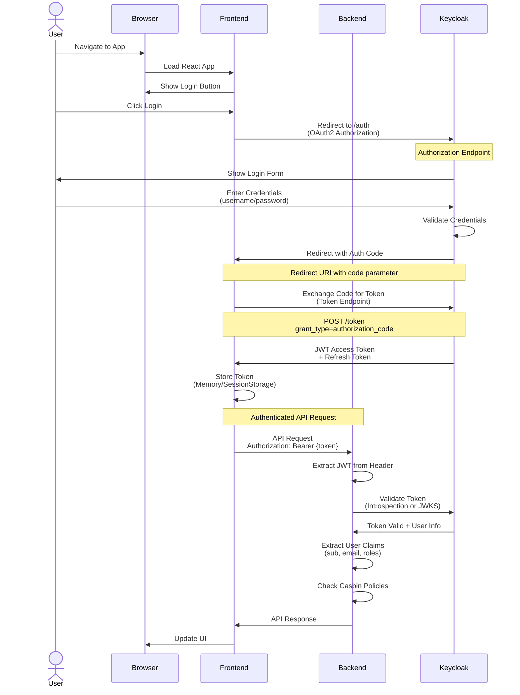
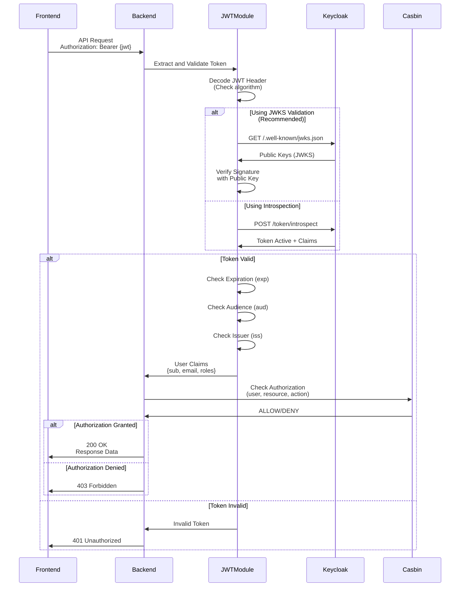
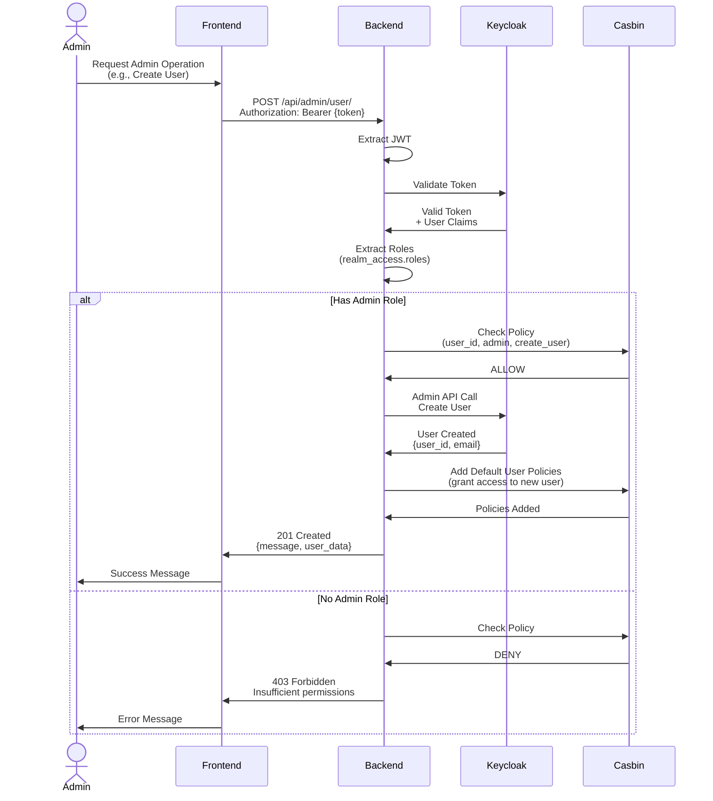
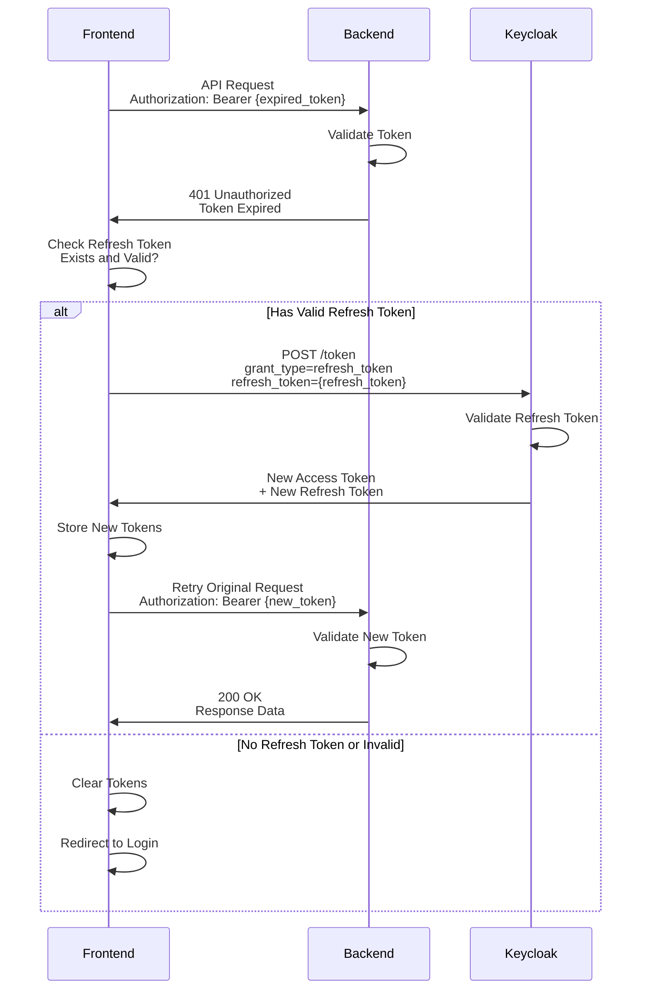
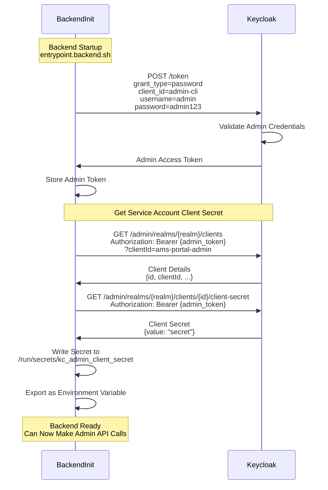
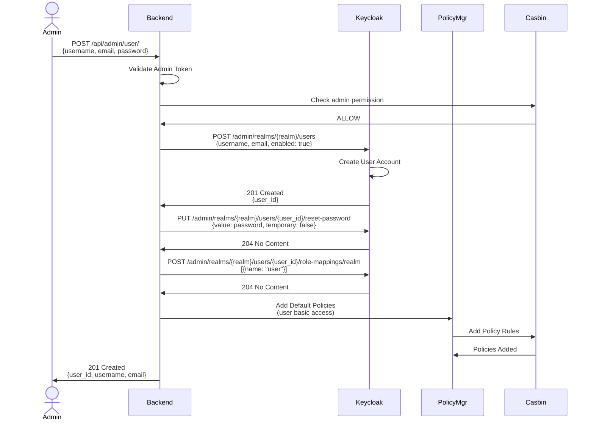
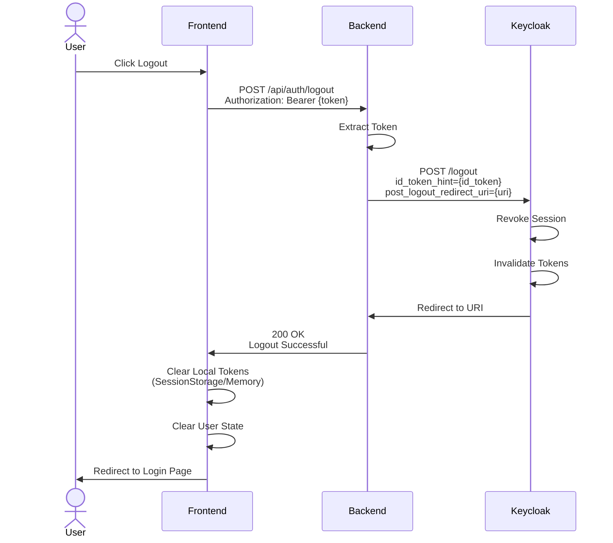

# Authentication Sequence Diagrams

## User Login Flow

Complete OAuth2/OIDC authentication flow with Keycloak.

## Token Validation Flow

How the backend validates JWT tokens from Keycloak.

## Admin Operation Flow

Authorization flow for admin-only operations.

## Token Refresh Flow

Refreshing expired access tokens without re-login.

## Service Account Flow (Backend to Keycloak)

How the backend uses its own service account to manage Keycloak.

## User Management Flow

Creating a new user through the admin API.

## Logout Flow

Proper session termination and token revocation.

---

## Authentication Patterns

### Pattern 1: Authorization Code Flow (Standard)
- **Use Case:** Web applications with a backend
- **Security:** Most secure, code exchange prevents token interception
- **Implementation:** Current system uses this

### Pattern 2: Implicit Flow (Legacy, Not Recommended)
- **Use Case:** Single-page apps (historical)
- **Security:** Less secure, token exposed in URL
- **Status:** Not used in this system

### Pattern 3: Client Credentials Flow
- **Use Case:** Service-to-service communication
- **Security:** Machine authentication, no user context
- **Implementation:** Backend uses this for Keycloak admin operations

### Pattern 4: Resource Owner Password Flow
- **Use Case:** Trusted first-party apps
- **Security:** Less secure, credentials exposed to client
- **Status:** Used only for admin CLI token in init scripts

---

## Security Considerations

### Token Storage
- ✅ **Memory/SessionStorage** - Current implementation
- ❌ **LocalStorage** - Vulnerable to XSS attacks
- ✅ **HTTP-only Cookies** - Alternative secure option

### Token Validation
- ✅ **JWKS-based** - Fast, no network call per request
- ✅ **Token Introspection** - Real-time revocation check
- ⚠️ **Signature Verification** - Always verify, never trust client

### Authorization Checks
- ✅ **Backend enforcement** - Never trust frontend
- ✅ **Casbin policies** - Fine-grained control
- ✅ **Role-based + Resource-based** - Defense in depth

---

**Last Updated:** 2025-10-23
