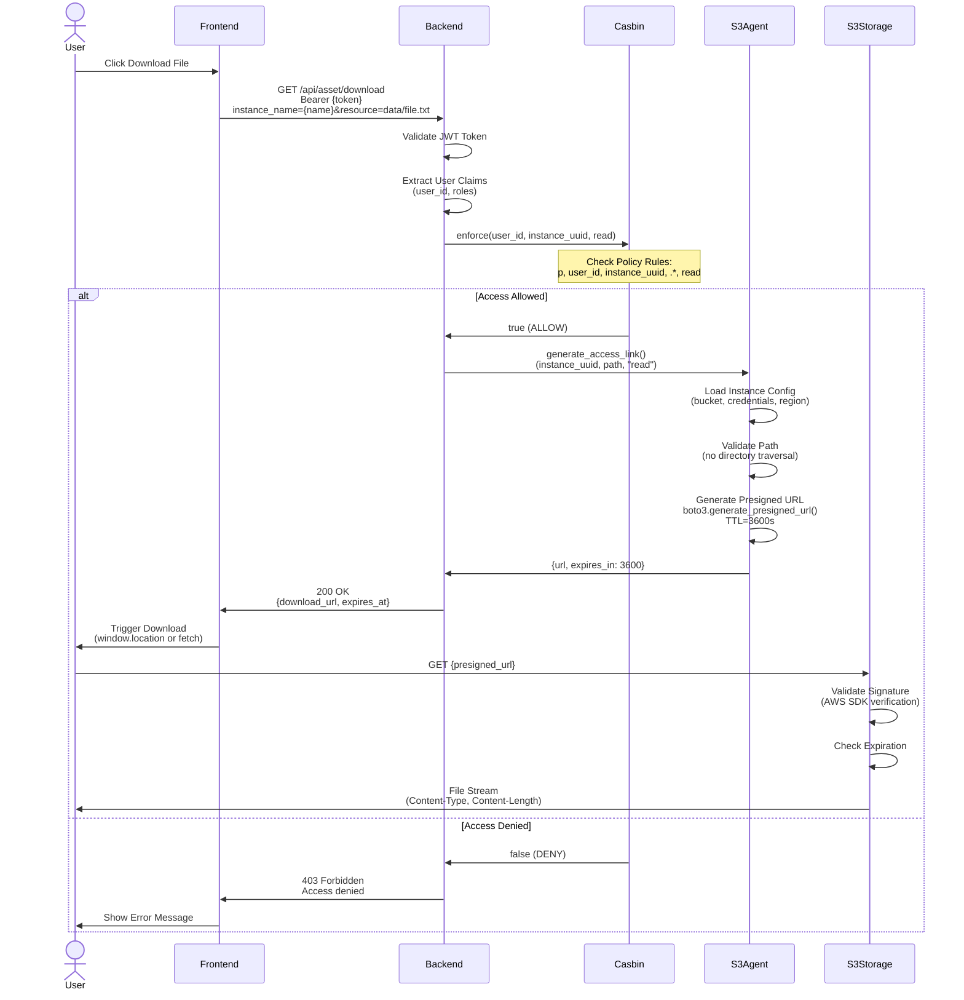
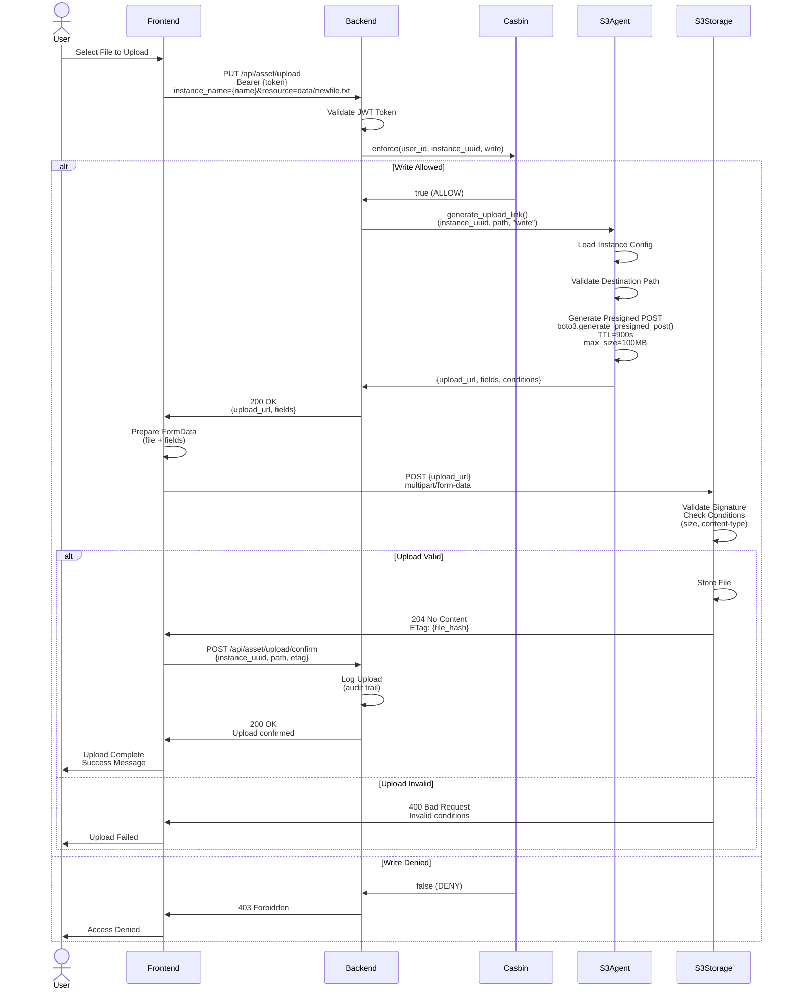
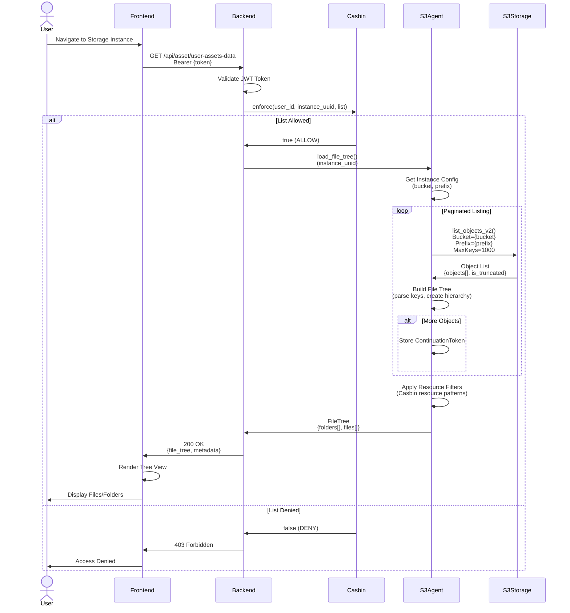
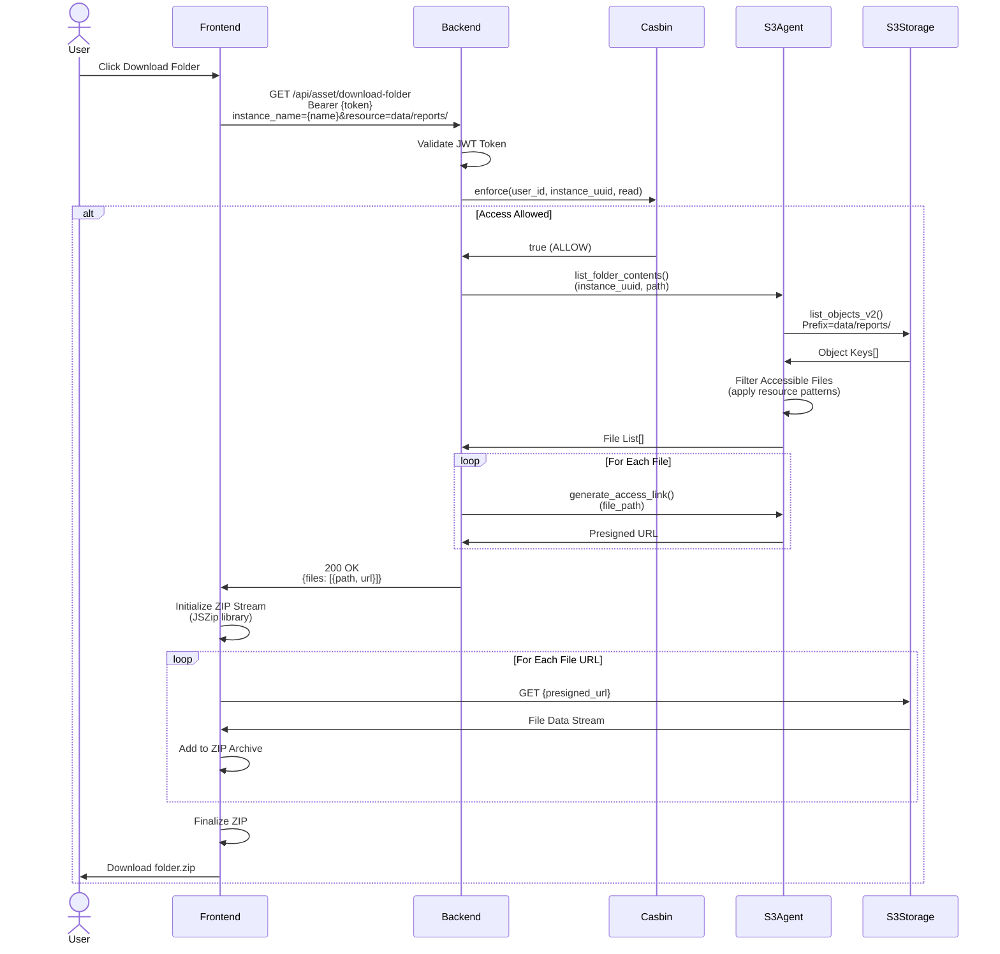
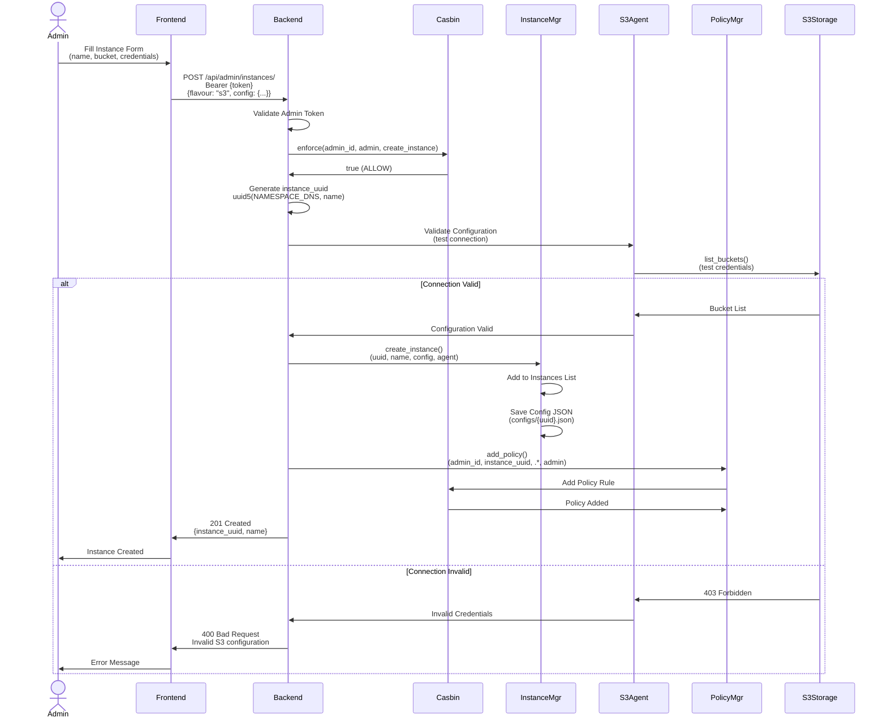
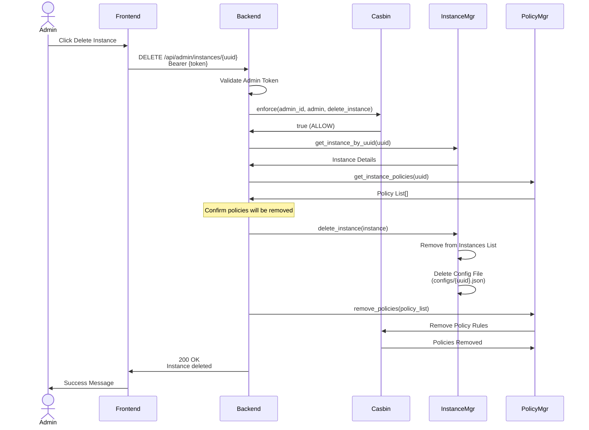

# Storage Access Sequence Diagrams

## File Download Flow (S3)

Complete flow for downloading a file from S3-compatible storage.



## File Upload Flow (S3)

Complete flow for uploading a file to S3-compatible storage.



## File Tree Loading

Loading directory structure from storage backend.



## Folder Download (ZIP)

Downloading an entire folder as a ZIP archive.



## Storage Instance Creation

Admin creating a new storage instance.



## Storage Instance Deletion

Admin deleting a storage instance and associated policies.



---

## Storage Agent Operations

### Supported Operations

| Operation | S3 Agent | Dummy Agent | Description |
|-----------|----------|-------------|-------------|
| `generate_access_link()` | ✅ Presigned GET URL | ✅ Mock URL | Get download URL |
| `generate_upload_link()` | ✅ Presigned POST | ✅ Mock URL | Get upload URL |
| `load_file_tree()` | ✅ S3 list_objects | ✅ Mock tree | List files/folders |
| `validate_config()` | ✅ Test credentials | ✅ Always valid | Check connection |

### Presigned URL Security

**S3 Presigned URLs include:**
- AWS Access Key ID (in query params)
- Signature (HMAC-SHA256 of request)
- Expiration timestamp
- Specific operation (GET/PUT/POST)
- Resource path (locked to specific object)

**Validation by S3:**
1. Check signature matches request
2. Verify not expired
3. Confirm operation matches
4. Validate resource path

---

## Access Control Patterns

### Pattern 1: User-Level Access
```
p, user_uuid, instance_uuid, .*, read
```
User can read all files in the instance.

### Pattern 2: Resource-Level Access
```
p, user_uuid, instance_uuid, data/project1/.*, read
```
User can only read files in `data/project1/` folder.

### Pattern 3: Operation-Level Access
```
p, user_uuid, instance_uuid, data/shared/.*, read
p, user_uuid, instance_uuid, data/uploads/.*, write
```
User can read from `shared` but only write to `uploads`.

### Pattern 4: Admin Access (Policy Management)
```
p, user_uuid, instance_uuid, .*, admin
```
User can manage policies for all resources in the instance.

**Note:** The "admin" action in Casbin is used for **policy management** only.
It grants the ability to view and modify access policies for the specified resources,
but does NOT grant file read/write/delete permissions.

**Separate from Keycloak Admin:** This is instance-level policy management permission,
distinct from the Keycloak realm "admin" role which grants system-wide admin operations.

---

**Last Updated:** 2025-10-23
